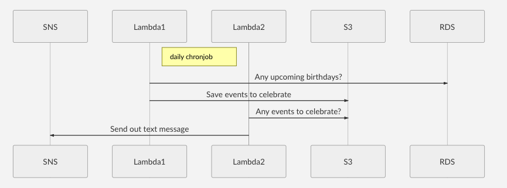

celebrate -- a SMS reminder service
====================================

### DESCRIPTION

A reminder service built on aws that sends out text messages about events. The events and their respective dates are stored on a database in a VPC, each day a lambda function will check for upcoming events and send the relevant data across a [VPC endpoint](https://aws.amazon.com/blogs/aws/new-vpc-endpoint-for-amazon-s3/) to a S3 bucket. Triggered by a second cron job another lambda function will read the data and send out a SMS. 

### RECOMMENDED TOOLS

* [awsume](https://awsu.me/) To assume aws role credentials 
* [serverless](https://www.serverless.com/) To develop and deploy on the aws without having to deal with cloudformation